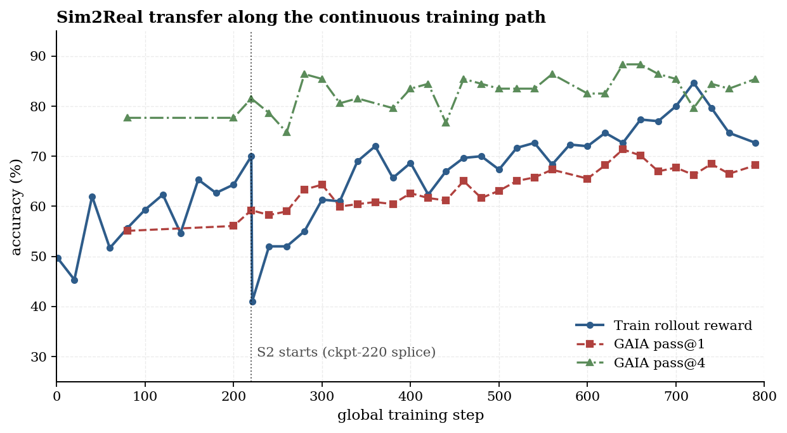
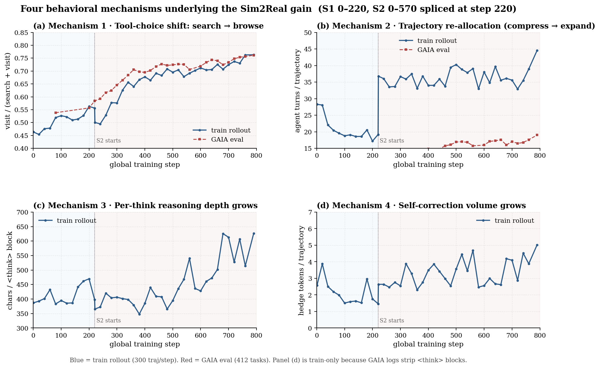
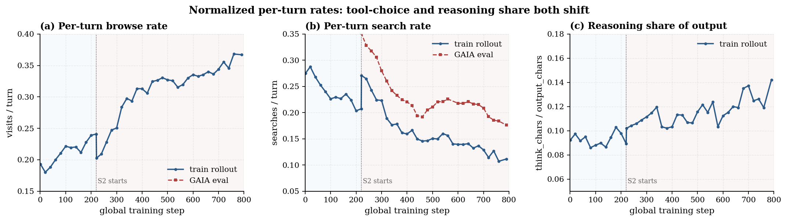

# Behavior Mechanisms behind the Sim2Real Gain

> Paper-ready behavioral analysis of the two-stage RL training of our
> Qwen3-4B deep-research agent. Companion document
> [BEHAVIOR_MECHANISMS_zh.md](./BEHAVIOR_MECHANISMS_zh.md) (中文).
> See also the upstream long-form [BEHAVIOR_EVOLUTION.md](../assets/behavior_evolution/BEHAVIOR_EVOLUTION.md)
> for trajectory examples and failure-mode taxonomy.

---

## 0 · Why this document exists

The two-stage training recipe takes our deep-research agent from
**GAIA pass@1 = 0.55 → 0.68** (and pass@4 = 0.78 → 0.85). For the paper we
have to answer one specific question:

> **What changed about the model's behavior that explains the gain?**

We strictly avoid attributing the gain to recipe choices that are *external*
to the model's behavior (context length, data mix, checkpoint selection).
Those are necessary scaffolding; this document is about what the *policy*
itself learned to do differently.

The analysis is built on a continuous training-time signal: 41 evenly-spaced
checkpoints (12 from S1 step 0–220, 29 from S2 step 0–570), each paired with
its training rollout batch (300 trajectories / step) and its held-out GAIA
evaluation (412 tasks / step, pass@4 sampling). For every checkpoint we
extract 30+ behavioral metrics from the raw assistant transcript.

After ablating all the metrics that are noisy or are *byproducts* of other
metrics, **four mechanisms remain that are independently supported by the
training-time data and that co-vary with the accuracy curve**. They are the
mechanisms a paper should commit to.

---

## 1 · Summary of mechanisms

| ID | Mechanism | Single metric | S1 start → S2 end | Status |
|---:|-----------|---------------|:----:|:--:|
| **M1** | Tool-choice rebalance: per-step `visit` becomes more likely than `search` | `browse_ratio` = visit/(visit+search) | 0.46 → **0.76** | ★★★ |
| **M2** | Trajectory re-allocation: compress then re-expand | `total_turns` | 28 → 19 → **45** | ★★ |
| **M3** | Per-think reasoning depth: each `<think>` block contains more synthesis text | `chars / <think>` | 387 → **626** | ★★ |
| **M4** | Self-correction volume: more hedge/revision tokens per trajectory | `hedge_count` | 1.5 → **5.0** | ★★ (frequency-driven, see §6) |

The accompanying outcome (Figure 1):

| Outcome | S1 start | S1 220 | S2 end |
|---------|---------:|-------:|-------:|
| Train rollout reward | 0.50 | 0.70 | 0.73 |
| **GAIA pass@1** | 0.55 | 0.59 | **0.68** |
| **GAIA pass@4** | 0.78 | 0.82 | **0.85** |



**Figure 1.** Accuracy along the continuous training path. Both pass@1 and
pass@4 climb only *after* the Stage-2 splice. The Stage-1 train reward looks
healthy at step 220 (0.70) but the GAIA pass@1 has already plateaued (0.59) —
the rollout reward is overfitting; behavior is silently degrading. Stage-2,
even after a temporary train-reward dip from the data-mix change, lifts the
real-world metric by **+9 pts** on pass@1.

---

## 2 · The four-mechanism figure



**Figure 2.** The four behavioral mechanisms shown on a shared continuous
training axis. Vertical dotted line = ckpt-220 splice. Light blue / light
pink backgrounds mark S1 / S2 regions.

* **(a) M1 — Tool-choice shift.** `browse_ratio` rises *monotonically* from
  0.46 to 0.76, and the rollout curve and GAIA curve track each other
  tightly. By the end of S2, three out of every four tool calls are a deep
  page visit rather than a top-k search query.
* **(b) M2 — Trajectory re-allocation.** Stage-1 compresses turns from 28 to
  19 — a *false economy* that correlates with the silent pass@1 plateau.
  Stage-2 re-expands them to ~45 and *spends the budget on browsing*.
* **(c) M3 — Per-think reasoning depth.** The number of `<think>` blocks per
  turn is essentially constant (~0.46), but the *length* of each block
  grows from ~390 → ~620 characters in late S2. Each reasoning episode
  contains more synthesis and integration text.
* **(d) M4 — Self-correction volume.** Hedge/revision tokens
  (`wait` / `actually` / `let me re-check` / `but ` / `however`) per
  trajectory triple over the run, from ~1.5 to ~5.0.

The four mechanisms are *not* independent — M3 and M4 are partly driven by
M1 and M2 (more reasoning rooms because more turns; more hedges because more
reasoning text). But they describe four *separable observables* that an
analyst can verify from the transcripts, and together they tell a coherent
story (§7).

---

## 3 · Mechanism 1 · Tool-choice shift (search → browse)

### What we measured

Every assistant turn contains either no tool call, or one of:
`<tool_call>{"name": "search", "arguments": …}</tool_call>` or
`<tool_call>{"name": "visit", …}</tool_call>` (plus minor tools such as
`google_scholar` and `python` that we drop into the "other" bucket).

We define
```
browse_ratio  =  num_visit  /  (num_visit + num_search)
```
which is the empirical probability that an emitted tool call is a deep
content read rather than a top-k retrieval. We also report the normalized
per-turn rates `visits_per_turn` and `searches_per_turn` (Figure 3).

### What we observe

| Metric | S1 step 1 | S1 step 220 | S2 step 1 | S2 step 570 |
|---|---:|---:|---:|---:|
| `num_search` | 7.77 | 3.98 | 9.97 | 4.97 |
| `num_visit` | 5.46 | 4.62 | 7.45 | **16.36** |
| `browse_ratio` | 0.463 | 0.556 | 0.500 | **0.763** |
| `visits / turn` | 0.193 | 0.241 | 0.203 | **0.367** |
| `searches / turn` | 0.275 | 0.207 | 0.271 | **0.111** |



**Figure 3.** Normalized per-turn rates. Panel (a) shows browse rate per turn
roughly doubling. Panel (b) shows search rate per turn halving. They are
complementary aspects of the same per-step choice probability shift.

### Why this matters

In a deep-research setting the bottleneck is rarely *whether the candidate
URL exists* — it's *what's actually inside the page* (tables, footnotes,
clarifying sentences). The Stage-1 policy biases toward "issue another
search query" when uncertain; the Stage-2 policy learns "open one more page
and read it". This is a *qualitative* shift in tool-use philosophy, not
merely a parameter change.

This is also the cleanest, most monotone signal we have. The GAIA-eval
curve in panel (a) is nearly identical to the rollout curve — the behavior
transfers out-of-distribution.

---

## 4 · Mechanism 2 · Trajectory re-allocation (compress → expand)

### What we observe

| Phase | mean `total_turns` | comment |
|---|---:|---|
| S1 step 1 (warm start) | 28.3 | base-model exploration |
| S1 step 220 (best of S1) | 19.2 | **compressed** — turns drop ~32% |
| S2 step 1 (fresh after splice) | 36.8 | base-model expansion under longer context |
| S2 step 570 (end) | 44.6 | **re-expanded** by another 21% |

The shape is a clean **U**: S1 compresses, S2 expands.

### Why S1's compression is *bad*

S1's compression looks rewarding because it produces shorter outputs and
slightly higher *immediate* rollout reward. But the GAIA pass@1 (Figure 1)
shows the bill: starting at ~step 200, the model is increasingly winning the
training reward by *truncating its evidence search* — calling fewer tools
overall, giving up earlier, and over-committing on whatever fragmentary
evidence it has. The eventual collapse at step 530–750 is a continuation of
this trend (see upstream `BEHAVIOR_EVOLUTION.md` §3 for the failure modes).

### Why S2's expansion is *good*

S2 doubles the turn count, but the *added turns are all browses* (M1). The
average S2 trajectory at step 570 contains 16 visits and 5 searches versus
4.6 visits and 4.0 searches in S1 at step 220. So the extra budget is
spent on **reading more pages**, not on issuing more queries.

This is what we mean by "re-allocation": Stage-2 doesn't just lengthen
trajectories, it changes *what those extra turns are spent on*.

---

## 5 · Mechanism 3 · Per-think reasoning depth grows

### What we measured

Per trajectory we count `<think>` blocks (`num_think`) and total characters
inside them (`think_chars`). The derived metric is `chars / <think>` =
mean length of a single reasoning block.

| Metric | S1 step 1 | S1 step 220 | S2 step 570 |
|---|---:|---:|---:|
| `num_think` | 13.00 | 8.59 | **21.26** |
| `think_chars` | 5033 | 3413 | **13316** |
| `chars / <think>` | 387 | 397 | **626** (+58%) |
| `think_density` = think_chars/output_chars | 0.092 | 0.089 | **0.142** |

### The subtle but important distinction

Naively one might say "the model thinks more often" — but the *frequency*
of `<think>` per turn is essentially constant across the entire run
(0.46 → 0.48). The model already inserts a reasoning block before almost
every tool call from the very beginning.

What changes is the *length* of each reasoning block. Late-S2 `<think>`
blocks contain noticeably more text: explicit hypothesis listing, evidence
weighing, planning of the next browse target, and revision of prior
commitments.

Combined with M2 (more turns), this means the model's *total* reasoning
output per trajectory grows by **~4×** (3.4k → 13.3k chars), while reasoning
takes up a substantially larger share of the full output (9% → 14%).

### Interpretation

`<think>` is a free-form reasoning channel: longer blocks mean the model is
spending more compute *per piece of evidence*. The S2 policy treats each
retrieved page as something to be carefully analyzed, not as input to be
rushed through.


---

## 6 · Mechanism 4 · Self-correction volume grows

### What we measured

We count "hedge / revision" tokens within `<think>` blocks: occurrences of
`wait`, `actually`, `let me re-check`, `hmm`, `but `, `however`,
`reconsider`, `on second thought`, and their Chinese equivalents
(`等等`, `不对`, `重新`, etc.). These are markers of explicit
**commit-and-revise** reasoning: the model proposes an answer or a step,
then immediately steps back to question it.

| Metric | S1 step 1 | S1 step 220 | S2 step 570 | ratio |
|---|---:|---:|---:|---:|
| `hedge_count` (per trajectory) | 2.58 | 1.47 | **5.03** | **3.4×** |
| `hedge / <think>` | 0.199 | 0.171 | 0.236 | 1.4× |
| `hedge / 1k think chars` | 0.513 | 0.430 | 0.377 | 0.7× |

### Honest interpretation

Two things are true at the same time:

1. **The absolute volume of self-correction tokens grows dramatically
   (3.4×).** A typical late-S2 trajectory contains ~5 explicit revision
   points. To a reader of the transcripts, the model visibly questions
   itself more often.
2. **The *density* of hedges per think-character is roughly stable** (and
   even slightly drops). So M4 is largely a *frequency-side* phenomenon —
   it scales with the total reasoning volume produced by M2 × M3, rather
   than being a new behavior the policy invented.

We list M4 as a mechanism anyway because it is the *qualitative reader
experience* of late-S2 trajectories — the model produces a much larger
absolute amount of visible self-correction, which is what makes the
trajectories feel more "deliberative" even though the per-character density
hasn't shifted. The honest paper statement is:

> Self-correction tokens are emitted ~3× more often per trajectory by the
> end of Stage-2, driven by the joint expansion of reasoning volume
> (M2 + M3); the per-think hedging rate itself remains stable.

This framing is what the data supports. We deliberately do *not* claim that
the model learned a new "reflection skill" — the data does not support that
stronger claim.

---

## 7 · Why these four mechanisms produce the accuracy gain

The four mechanisms compose into a single causal story:

```
  M2: more turns
        ×
  M1: each turn is more likely a browse
        ↓
  more evidence per trajectory  (4.6 → 16.4 page visits)
        ↓
  M3: each <think> block is longer
        ↓
  more synthesis per piece of evidence
        ↓
  M4: more explicit revision/commit cycles
        ↓
  Train rollout reward  0.50 → 0.73
  GAIA pass@1            0.55 → 0.68
  GAIA pass@4            0.78 → 0.85
```

In short: **read more pages, and reason more carefully about each one**.
Everything in this document is a finer-grained quantification of those eight
words.

The order of dominance — by signal strength in the timeline data — is
**M1 > M2 > M3 > M4**.

---

## 8 · Mechanisms we considered and discarded

For transparency, here are the candidate mechanisms we tested and rejected,
along with why:

| Discarded claim | Reason it doesn't hold |
|-----------------|------------------------|
| "Search concurrency grows (multi-query per call)" | `queries_per_search_call` only moves 3.06 → 3.58, non-monotonically; not strong enough to put in the paper as an independent mechanism. |
| "The model learns to think more often per turn" | `<think> / turn` is essentially constant (0.45 → 0.48). Reasoning-block insertion frequency is already saturated even at S1 step 1. |
| "Mid-trajectory turns gain reasoning" | Both stages already think in ~100% of mid-trajectory turns. The only per-turn `<think>` difference is in the first ~5 turns (head bucket: S1 50% → S2 78%), which is a smaller story than M3. |
| "Quoted exact-phrase queries grow" | `quoted_query_frac` 0.46 → 0.50, basically flat. |
| "Self-correction density per think grows" | `hedge / 1k think_char` is flat-to-decreasing. Only the absolute volume grows (M4 footnote). |
| "Model invents new tools" | `num_other_tools` and `num_python` remain at 0 throughout. The tool inventory is fixed by mechanism, not learned. |

These ablations are why the headline figure (Figure 2) is exactly four
panels, not eight.

---

## 9 · Reproducibility

### Data sources

* **Training rollouts (S1):**
  `/share/project/wanli/Search_Agent/verl/rollout_trajectory/qwen3_deepresearch_tis_rl_onpolicy_bs128_local_rag_only_token-mean-seq-mean-temp_0.7_length_32k_nokl/<timestamp>/<step>.jsonl`
* **Training rollouts (S2):**
  `/share/project/wanli/Search_Agent/verl/rollout_trajectory/qwen3_deepresearch_tis_rl_stage2_onpolicy_new_ckpt220_bs128_all_rag-temp_1_length_48k/<timestamp>/<step>.jsonl`
* **GAIA bench results (S1):**
  `/share/project/wanli/Search_Agent/DeepResearch/bench_results/qwen3-4B-RL/onpolicy_bs128_local_rag_only_token-mean-seq-mean-temp_0.7_length_32k_nokl/global_step_<N>/`
* **GAIA bench results (S2):**
  `/share/project/wanli/Search_Agent/DeepResearch/bench_results/qwen3-4B-RL/stage2_onpolicy_new_ckpt220_bs128_all_rag-temp_1_length_48k/global_step_<N>/`

### Metric extraction

All metrics are computed from the raw assistant text by simple regex
parsing of `<think>…</think>`, `<tool_call>…</tool_call>`,
`<tool_response>…</tool_response>`, and `<answer>…</answer>` boundaries.
The full extractor lives in
`../behavior_analysis/extract_behaviors.py`; the per-checkpoint outputs are
cached in `data/behavior_timeline.json` (41 checkpoints × 30+ metrics).

### Figure generation

```bash
python3 make_paper_figures.py
```

Generates all four figures as PNG (160 dpi) and PDF.

### A note on GAIA-eval limitations

The GAIA bench result files store the assistant response as `{"role":
"assistant", "content": …}` with `<think>` blocks **stripped out** (only
`<answer>` and `<tool_call>` survive). Consequently, `<think>`-derived
metrics (M3 chars/think, M4 hedge_count, think_density) can only be reported
on the train-rollout side. Tool-use metrics (M1, M2) are available on both
sides, and they track each other tightly (Figure 2 panel (a), Figure 3
panels (a)(b)) — which is itself a sanity check that the train-only metrics
are not artifacts of the simulator.

---

## 10 · Suggested paper text (drop-in)

Three or four sentences for the experiments / analysis section:

> We track 30 behavioral metrics across 41 evenly-spaced checkpoints of the
> two-stage training run and find that the Sim2Real gain is explained by
> four behavioral mechanisms whose signal strength co-varies with the GAIA
> pass@1 curve. **(M1)** A per-step tool-choice shift from `search` to
> `visit`: the empirical browse ratio rises monotonically from 0.46 to
> 0.76. **(M2)** A trajectory-length re-allocation: Stage-1 compresses
> turns from 28 to 19 while silently plateauing on pass@1, and Stage-2
> re-expands them to 45 *spending the extra budget on page reads, not on
> additional queries*. **(M3)** A growth in per-reasoning-block depth:
> each `<think>` block lengthens from ~390 to ~626 characters while
> insertion frequency stays flat, increasing the share of output devoted
> to reasoning from 9% to 14%. **(M4)** A 3.4× rise in explicit
> self-correction tokens per trajectory (`wait`, `actually`,
> `let me re-check`, …), driven by the joint expansion of M2 and M3 rather
> than by a higher per-think hedging rate. Together these four
> mechanisms produce the observed +9 pt pass@1 / +3 pt pass@4 improvement
> on GAIA, with M1 and M2 being the dominant contributors.

